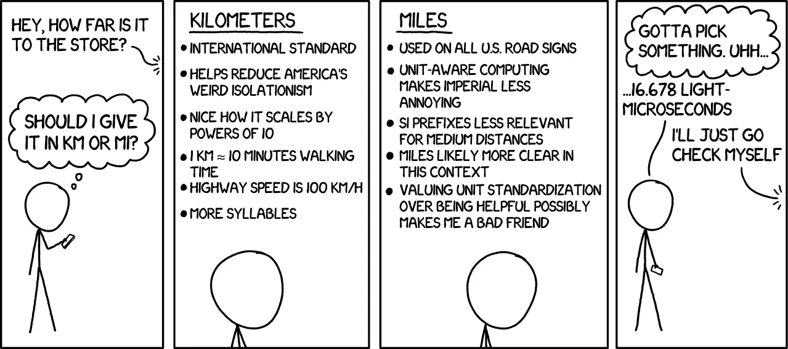

Metric or Imperial? Those are the two ways to measure distance.

On the one hand, Metric is the international standard, it scales better than Imperial, and it has several nice approximations (1 kilometer ≈ 10 minutes walking time).

But on the other hand, Feet are simply a more convenient length than Meters. Also, I'm American, so the vast majority of the people I interact with use Imperial, making it more useful.

I prefer Metric and use it whenever possible, but I'm aware that using it has the unfortunate side effect of making me seem like a contrarian elitist.

So imagine my delight when I had an idea for a completely new system that nobody uses based on common knowledge like quantum metaphysics!

## What is a Planck Length?

For the rest of the article to make sense, you'll need a basic understanding of why the Planck Length is so important, so here's a brief wildly oversimplified quantum metaphysics lesson.

The smaller something is, the less it's affected by **general gravity** and the more it starts to be affected by **quantum gravity**. We don't yet know how to accurately model the effects of quantum gravity, so the more influencial quantum gravity is the less accurately we're able to measure things. Even perfectly flat surfaces look wavy and foamy due to quantum uncertainty. 

The length where general and quantum gravity are equal is called a **Planck Length**. It's the smallest length we can measure with any amount of accuracy, so it's commonly described as the pixel size of the universe.

The Planck Length is a **fundamental constant**, which is just a physics word for 'very important number'.

Good measurement systems are defined by fundamental constants (0°K is defined at absolute zero), and bad ones are defined by imprecise arbitrary nonsense (0°F is defined at the lowest recorded temperature of the Polish city of Gdańsk).

## Planck Magnitudes

All of this started in mid-2024 when I was multiplying and converting the Planck Length by exponentiated magnitudes. I was bored, okay?

Anyways, I noticed that 10^38 (or 100,000,000,000,000,000,000,000,000,000,000,000,000) Planck Lengths is equal to ~1.00429431 miles.

This got my attention.

The primary advantage of the Imperial system is that is uses convenient lengths. We can recreate those lengths to within 1 part per 100 using exact supermultiples of the Planck Length.

Hmm.

What about feet and inches? 10^34 Planck Length is ~6.36320876 inches. This is within 1 part per 10 of 6 inches, or half a foot. So 2x10^34 is ~1.06053479 feet within 1 part per 10.

So by multiplying the most important distance (Planck Length) by the most important number (10) enough times, we get convenient lengths that are *really* close to those of the Imperial system.

## Unit Abstraction

Of course, it isn't that simple. Even at my most naive, I couldn't expect people to say "I'm 103,721,256,856,127,281,896,237,392,354,257,836 Planck Lengths tall."

The solution is to create a new unit, defined as exactly 10^34 Planck Lengths (~6.3 inches). Then you would just say "I'm 10.37 (new unit) tall".

The question then becomes: 'what do we call this new unit?'

## Unit Names

If we were using the Metric standard, we would express 10^34 by combining the SI prefixes deca (10^1) ronto (10^33), into decaronto. A Decarontoplanck doesn't quite roll off the tongue. So instead we'll invent a new term.

Here are a few ideas:

- **Mark**: This is the first name I thought of because apparently I'm an narcissist
- **Plonck**: Etymologically related to 'Planck'; fun to say
- **Quanth**: A portmanteau of 'quantum' and 'length'; also fun to say

I'm leaning towards Quanth right now, so I'll tentatively call it that for the rest of the article.

## Prefixed Units

To describe distances other than ~6.3 inches, we apply SI prefixes to Quanth, just like with Meters.

| Unit           | Planck Lengths | Quanth           | Imperial Approx   | Metric Approx     |
|----------------|----------------|------------------|-------------------|-------------------|
| **Microquanth**| 10^28          | 0.000001 Quanth  | 1/158000 Inches   | 1.61 Micrometers  |
| **Milliquanth**| 10^31          | 0.001 Quanth     | 1/158 Inches      | 161 Micrometers   |
| **Quanth**     | 10^34          | 1 Quanth         | 6.3 Inches        | 1.61 Meters       |
| **Kiloquanth** | 10^37          | 1,000 Quanth     | 525 Feet          | 161 Meters        |
| **Myriaquanth**| 10^38          | 10,000 Quanth    | 1 Mile            | 1.61 Kilometers   |
| **Megaquanth** | 10^41          | 1,000,000 Quanth | 1,000 Miles       | 161 Kilometers    |

I suggest that we abbreviate 'Myriaquanth' (~1 mile) as 'Myr' (pronounced like in '**mir**ror') in common usage. So you would say "The road is 5 Myr long". 

## Conclusion

I think that the Quanth elegantly bridges the gap between logic and convenience; between absolute empirical accuracy and what's on road signs.

Imagine a world where everyday intuition and scientific precision align, where human-scale units are informed by the universe's pixel.

...

Of course, that'll never happen and I don't expect anyone to use my system I just thought it was cool okay bye

~Ethan
